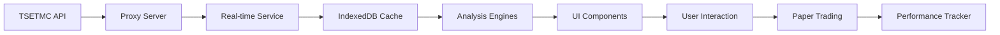

# مستندات توسعه‌دهندگان نبض بازار (Nabz Bazar)

## فهرست مطالب

1. [معرفی پروژه](#introduction)
2. [معماری سیستم](#architecture)
3. [ماژول‌های جدید](#modules)
4. [راهنمای نصب و راه‌اندازی](#setup)
5. [ساختار کد](#structure)
6. [API Reference](#api-reference)
7. [بهترین روش‌ها](#best-practices)
8. [عیب‌یابی](#troubleshooting)

---

## 1. معرفی پروژه <a name="introduction"></a>

**نبض بازار** یک پلتفرم تحلیل بازار سرمایه ایران است که با استفاده از تکنولوژی‌های مدرن وب ساخته شده است.

### ویژگی‌های کلیدی

- 📊 **تحلیل چندبعدی**: تکنیکال، فاندامنتال، تابلوخوانی، حجمی
- 🤖 **دستیار هوشمند**: چت‌بات تحلیلی و پیشنهاد سبد سهام
- 👥 **ترید اجتماعی**: اشتراک‌گذاری سیگنال‌ها و لیدربورد
- ⚡ **عملکرد بالا**: بهینه‌سازی شده برای load time سریع
- 📱 **واکنش‌گرا**: پشتیبانی کامل از موبایل و دسکتاپ
- 💾 **آفلاین**: قابلیت کار بدون اینترنت با کش داده‌ها

### تکنولوژی‌های استفاده شده

```
Frontend:
├── React 19
├── TypeScript 5.9
├── Vite 7
├── TailwindCSS 4
├── Shadcn UI
├── Framer Motion
└── React Router 7

Backend (Optional):
├── Convex (برای احراز هویت و دیتابیس)
└── Hono (برای API proxy)

Data Sources:
├── TSETMC (داده‌های بازار)
├── Codal (گزارش‌های مالی)
└── TGJU (قیمت‌های جهانی)
```

---

## 2. معماری سیستم <a name="architecture"></a>

### ساختار کلی

```
src/
├── components/          # کامپوننت‌های UI
│   ├── market/         # کامپوننت‌های تخصصی بازار
│   └── ui/             # کامپوننت‌های پایه Shadcn
├── lib/                # توابع و سرویس‌های کمکی
├── pages/              # صفحات اصلی برنامه
├── hooks/              # Custom React Hooks
├── types/              # تعاریف TypeScript
└── modules/            # ماژول‌های مستقل (جدید)
    ├── ai-assistant/   # دستیار هوشمند ترید
    ├── social-trading/ # ترید اجتماعی
    ├── performance/    # بهینه‌سازی عملکرد
    └── docs/           # مستندات
```

### جریان داده



---

## 3. ماژول‌های جدید <a name="modules"></a>

### 3.1 ماژول دستیار هوشمند (AI Assistant)

**مسیر**: `src/modules/ai-assistant/`

#### امکانات

- تحلیل خودکار وضعیت بازار
- پیشنهاد سبد سهام بر اساس ریسک
- پاسخ به سوالات کاربران
- مدیریت ریسک و آموزش

#### نحوه استفاده

```typescript
import { 
  getAIAssistant, 
  processUserQuery,
  calculateMarketScore 
} from '@/modules/ai-assistant';

// دریافت نمونه دستیار
const assistant = getAIAssistant({
  language: 'fa',
  defaultRiskTolerance: 'medium'
});

// ارسال پیام
const response = await assistant.sendMessage(
  'وضعیت بازار چطوره؟',
  marketData,  // آرایه‌ای از داده‌های بازار
  signals      // آرایه‌ای از سیگنال‌ها
);

console.log(response.content);
```

#### رابط‌ها

```typescript
interface ChatMessage {
  id: string;
  role: "user" | "assistant" | "system";
  content: string;
  timestamp: Date;
  metadata?: {
    confidence?: number;
    actionType?: "analysis" | "suggestion" | "warning" | "info";
  };
}

interface PortfolioSuggestion {
  symbol: string;
  allocation: number;
  reason: string;
  riskLevel: "low" | "medium" | "high";
  expectedReturn: number;
  stopLoss: number;
  takeProfit: number;
}
```

---

### 3.2 ماژول ترید اجتماعی (Social Trading)

**مسیر**: `src/modules/social-trading/`

#### امکانات

- اشتراک‌گذاری سیگنال‌های معاملاتی
- دنبال کردن تریدرهای موفق
- لیدربورد برترین تریدرها
- سیستم لایک و کامنت

#### نحوه استفاده

```typescript
import { 
  getSocialTrading,
  createDemoSignal 
} from '@/modules/social-trading';

const social = getSocialTrading();

// اشتراک‌گذاری سیگنال
const signal = social.shareSignal({
  traderId: 'user_123',
  traderName: 'علی رضایی',
  symbol: 'شستا',
  action: 'buy',
  entryPrice: 2500,
  targetPrice: 2900,
  stopLoss: 2300,
  status: 'active',
  description: 'سیگنال خرید با هدف ۱۵٪ سود'
});

// دریافت لیدربورد
const leaderboard = social.getLeaderboard(10);

// لایک کردن سیگنال
social.likeSignal(signal.id);
```

---

### 3.3 ماژول بهینه‌سازی عملکرد (Performance)

**مسیر**: `src/modules/performance/`

#### امکانات

- مانیتورینگ Core Web Vitals
- تحلیل حجم باندل
- مدیریت کش
- Lazy loading utilities

#### نحوه استفاده

```typescript
import { 
  getPerformanceMonitor,
  getPerformanceMetrics,
  CacheManager 
} from '@/modules/performance';

// شروع مانیتورینگ
const monitor = getPerformanceMonitor();
monitor.startMonitoring(30000); // هر ۳۰ ثانیه

// دریافت معیارها
const metrics = await getPerformanceMetrics();
console.log('FCP:', metrics.fcp, 'ms');
console.log('LCP:', metrics.lcp, 'ms');

// دریافت پیشنهادات بهینه‌سازی
const suggestions = monitor.getSuggestions();

// مدیریت کش
const cache = new CacheManager('my-cache');
await cache.init();
await cache.set('key', { data: 'value' }, 3600);
```

---

## 4. راهنمای نصب و راه‌اندازی <a name="setup"></a>

### پیش‌نیازها

- Node.js 18+
- npm یا bun
- مرورگر مدرن (Chrome, Firefox, Edge)

### نصب

```bash
# Clone repository
git clone <repository-url>
cd nabz-bazar

# Install dependencies
npm install

# Start development server
npm run dev

# Build for production
npm run build

# Preview production build
npm run preview
```

### متغیرهای محیطی

```env
# اختیاری - برای اتصال به backend
VITE_CONVEX_URL=<your-convex-url>
CONVEX_DEPLOYMENT=<your-deployment>

# اختیاری - برای AI services
VITE_AI_API_KEY=<your-api-key>
VITE_AI_ENDPOINT=<your-endpoint>
```

---

## 5. ساختار کد <a name="structure"></a>

### کامپوننت‌ها

```tsx
// مثال: ساخت یک کامپوننت جدید
import { Card } from "@/components/ui/card";
import { Button } from "@/components/ui/button";

export function MyComponent() {
  return (
    <Card className="p-4">
      <h2 className="text-lg font-bold">عنوان</h2>
      <Button>کلیک کنید</Button>
    </Card>
  );
}
```

### هوک‌های سفارشی

```typescript
// مثال: ساخت یک hook جدید
import { useState, useEffect } from 'react';

export function useMarketData(symbol: string) {
  const [data, setData] = useState(null);
  const [loading, setLoading] = useState(true);

  useEffect(() => {
    // Fetch data logic
  }, [symbol]);

  return { data, loading };
}
```

### ماژول‌های جدید

هر ماژول باید ساختار زیر را داشته باشد:

```
modules/module-name/
├── index.ts          # نقطه ورود اصلی
├── types.ts          # تعاریف TypeScript
├── utils.ts          # توابع کمکی
├── config.ts         # تنظیمات
└── README.md         # مستندات خاص ماژول
```

---

## 6. API Reference <a name="api-reference"></a>

### Real-time Service

```typescript
import { realTimeService } from '@/lib/realtimeDataService';

// پیکربندی
realTimeService.configure({
  priceInterval: 5000,
  marketWatchInterval: 30000,
  enableOrderBook: true
});

// شروع
realTimeService.start();

// توقف
realTimeService.stop();

// ثبت callback
realTimeService.onUpdate((instruments) => {
  console.log('Updated:', instruments);
});
```

### Analysis Engines

```typescript
import { generateAllSignalsAsync } from '@/lib/analysisEngines';

const signals = await generateAllSignalsAsync(
  instruments,
  historicalData,
  daysBack
);
```

### IndexedDB

```typescript
import { getAll, put, remove } from '@/lib/idb';

// ذخیره
await put('STORE_NAME', key, value);

// خواندن
const data = await getAll('STORE_NAME');

// حذف
await remove('STORE_NAME', key);
```

---

## 7. بهترین روش‌ها <a name="best-practices"></a>

### Performance

✅ **انجام دهید:**
- از lazy loading برای تب‌ها استفاده کنید
- داده‌ها را در IndexedDB کش کنید
- از virtualization برای لیست‌های بزرگ استفاده کنید
- کامپوننت‌ها را با React.memo بهینه کنید

❌ **انجام ندهید:**
- داده‌های بزرگ را در state نگه ندارید
- درخواست‌های تکراری به API نزنید
- از رندرهای غیرضروری جلوگیری کنید

### Code Quality

✅ **انجام دهید:**
- از TypeScript استفاده کنید
- کامپوننت‌ها را کوچک و متمرکز نگه دارید
- خطاها را properly handle کنید
- تست بنویسید

❌ **انجام ندهید:**
- از any type استفاده نکنید
- کدهای تکراری ننویسید
- بدون کامنت کد پیچیده ننویسید

### Security

✅ **انجام دهید:**
- داده‌های کاربر را validate کنید
- از HTTPS استفاده کنید
- اطلاعات حساس را encrypt کنید

---

## 8. عیب‌یابی <a name="troubleshooting"></a>

### مشکلات رایج

#### 1. داده‌ها لود نمی‌شوند

```bash
# بررسی CORS
# بررسی network tab در DevTools
# بررسی کش: await clearAllCaches()
```

#### 2. Performance پایین است

```typescript
// اجرای گزارش performance
import { getPerformanceMonitor } from '@/modules/performance';
const report = getPerformanceMonitor().exportReport();
console.log(report);
```

#### 3. خطاهای TypeScript

```bash
# پاک کردن cache
rm -rf node_modules/.vite
npm run dev
```

### لاگ‌گیری

```typescript
// فعال کردن لاگ‌های مفصل
localStorage.setItem('DEBUG', 'true');
```

---

## ضمیمه‌ها

### الف) نقشه راه آینده

- [ ] اتصال به APIهای واقعی برای اخبار
- [ ] پیاده‌سازی WebSocket برای داده‌های لحظه‌ای
- [ ] افزودن backtest پیشرفته
- [ ] اپلیکیشن موبایل (React Native)
- [ ] سیستم alert پیشرفته

### ب) منابع مفید

- [مستندات React](https://react.dev)
- [مستندات Vite](https://vitejs.dev)
- [مستندات Tailwind](https://tailwindcss.com)
- [مستندات Shadcn](https://ui.shadcn.com)

### ج) تماس و پشتیبانی

برای سوالات و مشکلات:
- Issues GitHub
- ایمیل: support@nabzbazar.ir

---

**نسخه مستند**: 1.0.0  
**آخرین بروزرسانی**: 2025
